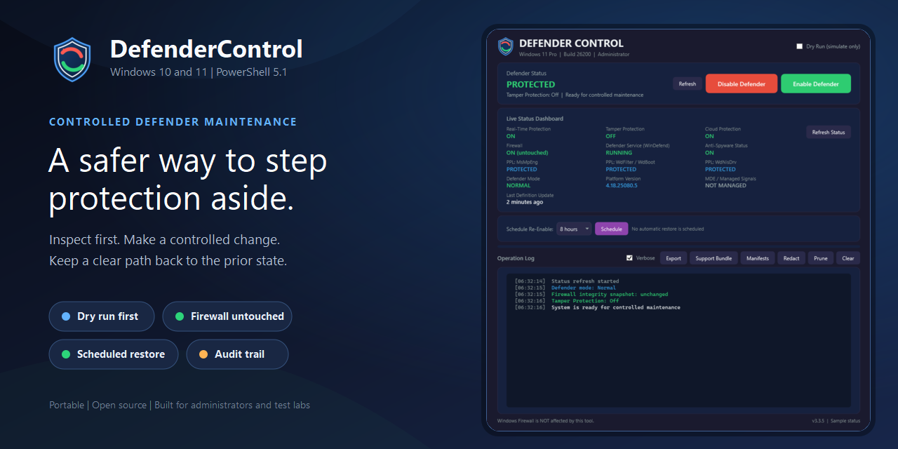
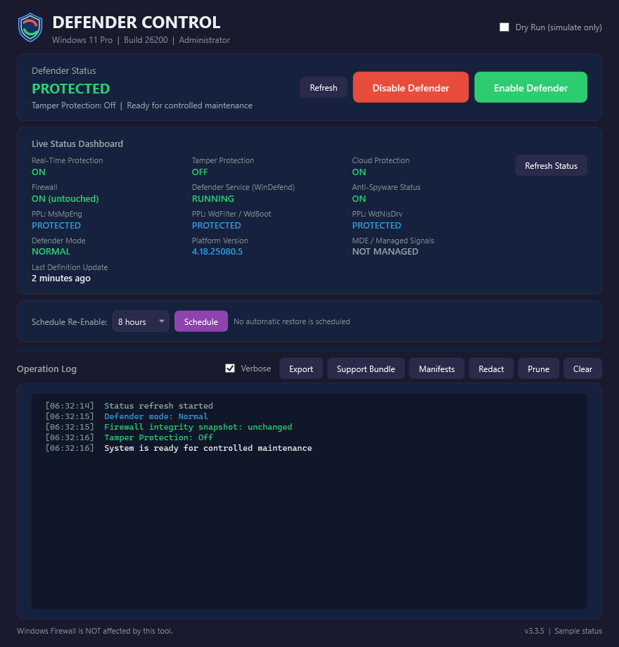
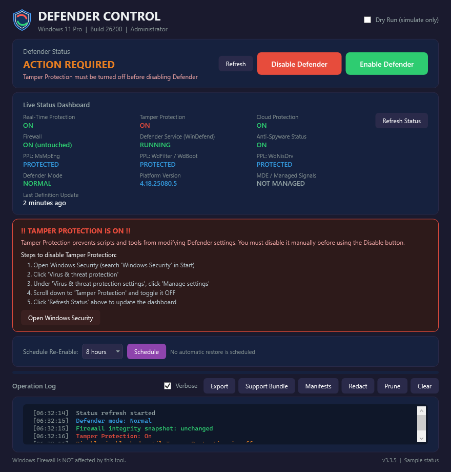

<p align="center">
  
</p>

<h1 align="center">DefenderControl</h1>

<p align="center"><strong>A guarded maintenance switch for Microsoft Defender.</strong></p>

<p align="center">
  Inspect the current protection state, make a controlled change, and keep a clear path back.
</p>

<p align="center">
  
  
  
  
</p>

<p align="center">
  <a href="https://github.com/SysAdminDoc/DefenderControl/releases/latest"><strong>Download the portable release</strong></a>
  &nbsp;|&nbsp;
  <a href="#quick-start"><strong>Quick start</strong></a>
  &nbsp;|&nbsp;
  <a href="#safety-model"><strong>Read the safety model</strong></a>
</p>

<p align="center">
  
</p>

> [!CAUTION]
> Disabling endpoint protection increases risk. Use DefenderControl for a
> controlled maintenance window, test lab, imaging workflow, or a machine with
> suitable alternative protection. Read the current state first and schedule
> re-enable when a time limit makes sense.

## Why administrators use it

Windows can turn real-time protection back on shortly after the standard toggle
is changed. DefenderControl coordinates the related preferences, policies,
services, tasks, and PPL flags that matter during a maintenance window. It can
then replay the recorded registry state and restore the normal configuration.

The app is deliberately narrow. It does not remove Defender files, modify boot
configuration, disable Windows Update, or touch Windows Firewall.

- **See the whole state first.** The dashboard reports real-time and cloud
  protection, Tamper Protection, service and PPL state, Defender mode, platform
  version, definition age, and managed-device signals.
- **Practice without changing anything.** Dry Run walks the same operation path
  and writes the planned work to the log.
- **Keep recovery close.** A restore point, transaction manifest, scheduled
  re-enable, and post-change verification give the operation more than one way
  back.
- **Leave evidence.** Manifests, Windows Application events, verification JSON,
  and redacted support bundles make the work reviewable later.

## Product screenshots

<p align="center">
  
</p>

<p align="center"><sub>The production WPF layout rendered offscreen with representative sample status. No Defender setting was changed for the capture.</sub></p>

<p align="center">
  
</p>

<p align="center"><sub>Tamper Protection gets an explicit blocking explanation and a direct route to Windows Security.</sub></p>

## Safety model

DefenderControl treats disable and restore as auditable operations, not blind
toggles.

| Guardrail | What it does |
| --- | --- |
| Dry Run | Shows the planned phases without changing Defender. |
| Restore point | Requests a Windows restore point before disable. Windows can throttle this to one point per 24 hours. |
| Firewall integrity check | Snapshots all firewall profiles plus `mpssvc` and `BFE`, then verifies they did not change. |
| Third-party AV preflight | Warns when Windows Security Center reports no alternative antivirus. |
| Tamper Protection gate | Explains the manual Windows Security step when Tamper Protection would undo the work. |
| Managed-device warning | Reports Defender for Endpoint, passive mode, EDR Block Mode, and device-policy signals before mutation. |
| Atomic transaction log | Records each registry value before and after the change, including whether it existed and its value kind. |
| Scheduled re-enable | Creates a self-cleaning SYSTEM task for 1, 2, 4, 8, or 24 hours. |
| Verification | Checks the effective state after disable or restore and uses stable exit codes for automation. |

No recovery mechanism can make disabling security software risk-free. A domain
policy, Tamper Protection, a Windows update, or a locked service can override a
local change. The app reports those cases instead of claiming success from a
registry write alone.

## Requirements

| Requirement | Details |
| --- | --- |
| Windows | Windows 10 1809 or newer, or Windows 11 |
| Shell | Windows PowerShell 5.1. Launching from PowerShell 7 hands off automatically. |
| Rights | Administrator. The GUI requests UAC elevation when needed. |
| Tamper Protection | Must be turned off manually for a complete disable operation. |

## Quick start

1. Download `DefenderControl-v3.3.5.zip` from the [latest release](https://github.com/SysAdminDoc/DefenderControl/releases/latest).
2. Extract the ZIP and review `README.md` plus `SHA256SUMS.txt` on the release page.
3. Right-click `DefenderControl.ps1` and choose **Run with PowerShell**.
4. Check the dashboard. Use **Dry Run** first if this is a new machine or policy environment.
5. Turn off Tamper Protection in Windows Security if the app reports it as on.
6. Choose **Disable Defender** or **Enable Defender**. Reboot if the result asks for it.

You can also launch it from an elevated console:

```powershell
powershell.exe -NoProfile -ExecutionPolicy Bypass -File ".\DefenderControl.ps1"
```

## Read-only command line

The command line is designed for inventory, verification, and support data.
Disable and Enable remain GUI-only so a mutating operation keeps its status,
warnings, and recovery controls visible.

```powershell
# Compact current state
powershell.exe -NoProfile -ExecutionPolicy Bypass -File ".\DefenderControl.ps1" -Mode Status

# Services, PPL, tasks, policy keys, Defender mode, and third-party AV
powershell.exe -NoProfile -ExecutionPolicy Bypass -File ".\DefenderControl.ps1" -Mode Health

# Stable JSON for inventory or automation
powershell.exe -NoProfile -ExecutionPolicy Bypass -File ".\DefenderControl.ps1" -Mode Health -Json

# Review the latest operation manifest
powershell.exe -NoProfile -ExecutionPolicy Bypass -File ".\DefenderControl.ps1" -Mode Manifest -Json

# Create a redacted support ZIP on the Desktop
powershell.exe -NoProfile -ExecutionPolicy Bypass -File ".\DefenderControl.ps1" -Mode SupportBundle
```

All modes require Administrator rights. When a non-elevated CLI process triggers
UAC, output appears in the elevated window. Elevate the calling shell first when
stdout, stderr, and the exit code must return to an automation caller.

### Verify the effective state

```powershell
# Expect normal protection
powershell.exe -NoProfile -ExecutionPolicy Bypass -File ".\DefenderControl.ps1" -Mode Verify -Expect Enabled

# Expect a completed disable operation
powershell.exe -NoProfile -ExecutionPolicy Bypass -File ".\DefenderControl.ps1" -Mode Verify -Expect Disabled

# Machine-readable verification report
powershell.exe -NoProfile -ExecutionPolicy Bypass -File ".\DefenderControl.ps1" -Mode Verify -Json
```

The optional EICAR check writes the standard harmless detection string to a
temporary path, waits for Defender, and cleans the path. It requires both
`-Eicar` and `-Force`:

```powershell
powershell.exe -NoProfile -ExecutionPolicy Bypass -File ".\DefenderControl.ps1" -Mode Verify -Expect Enabled -Eicar -Force
```

| Exit code | Meaning |
| --- | --- |
| `0` | Success |
| `1` | Partial result |
| `2` | Blocked by Tamper Protection |
| `3` | Safe Mode is required for a locked change |
| `4` | Usage or unsupported-OS error |
| `5` | Verification failed |

## What changes during disable

The ten phases are visible in the operation log:

1. Request a System Restore point.
2. Read Tamper Protection and current endpoint state.
3. Apply Defender preferences and exclusions needed for the maintenance window.
4. Apply Defender policy registry values.
5. Change Defender notifications and its tray startup entry.
6. Disable Defender scheduled tasks.
7. Change Defender service start values and related PPL flags.
8. Remove the Defender Explorer context-menu entries.
9. Change SmartScreen and signature-update settings.
10. Stop non-protected Defender processes and verify the result.

Enable replays the latest disable manifest in reverse, applies known Windows
defaults where needed, restores tasks and shell entries, updates signatures,
starts the services it can start, and verifies the effective state.

## Manifests and support bundles

Each operation writes JSON under
`%ProgramData%\DefenderControl\manifests\`. The default retention policy keeps
30 days and the newest 50 files. The GUI and `-Mode Manifest` can list, prune,
or export them.

Manifests and logs can contain the computer name, Defender platform details,
installed security-provider names, registry paths, and phase results. Use the
**Redact** action before sharing data. A support bundle can also include recent
Application events, crash logs, and an optional Microsoft `MpSupportFiles.cab`.

## Known limits

- Tamper Protection cannot be disabled programmatically. Windows may appear to
  accept a setting and then restore it.
- Defender for Endpoint, Intune, or domain policy can override local state.
- `MsMpEng.exe` runs as a protected process and normally remains until reboot.
- Windows Home accepts many policy registry values but does not provide the
  same Group Policy behavior as Pro or Enterprise.
- A heavily locked service key can require a controlled Safe Mode maintenance
  window.

## Build and verification

Run the full local validation harness under Windows PowerShell 5.1:

```powershell
powershell.exe -NoProfile -ExecutionPolicy Bypass -File ".factory\test-all.ps1"
```

It checks both PowerShell parsers, loads the production XAML, validates the
functions injected into background runspaces, exercises state, verification,
transaction replay, support bundles, and manifest controls, then runs the
documented PSScriptAnalyzer baseline.

Rebuild the brand assets, screenshots, marketing card, and portable ZIP with:

```powershell
powershell.exe -NoProfile -ExecutionPolicy Bypass -File ".factory\build-brand-assets.ps1"
powershell.exe -NoProfile -STA -ExecutionPolicy Bypass -File ".factory\capture-marketing.ps1" -State Dashboard -OutputPath "screenshots\defender-control-dashboard-v3.3.5.png"
powershell.exe -NoProfile -STA -ExecutionPolicy Bypass -File ".factory\capture-marketing.ps1" -State Tamper -OutputPath "screenshots\defender-control-tamper-guidance-v3.3.5.png"
powershell.exe -NoProfile -ExecutionPolicy Bypass -File ".factory\build-marketing-assets.ps1"
powershell.exe -NoProfile -ExecutionPolicy Bypass -File ".factory\build-release.ps1"
```

The capture script renders the production WPF XAML in a hidden offscreen window
with sample values. It does not query or change Defender. The release build
cleans `dist\`, creates `DefenderControl-v3.3.5.zip`, includes the documentation
assets, and writes SHA-256 checksums.

## Privacy and security

DefenderControl has no account, telemetry service, or resident background
process. It writes local logs, manifests, scheduled restore tasks, crash logs,
and Windows Application events as described above. Review the script before
running it on a production machine.

Security reports can be filed through the repository's private security
advisory form. Do not put sensitive machine or policy data in a public issue.

## License

DefenderControl is available under the [MIT License](LICENSE).
